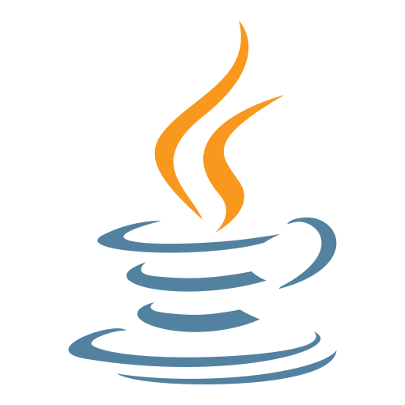
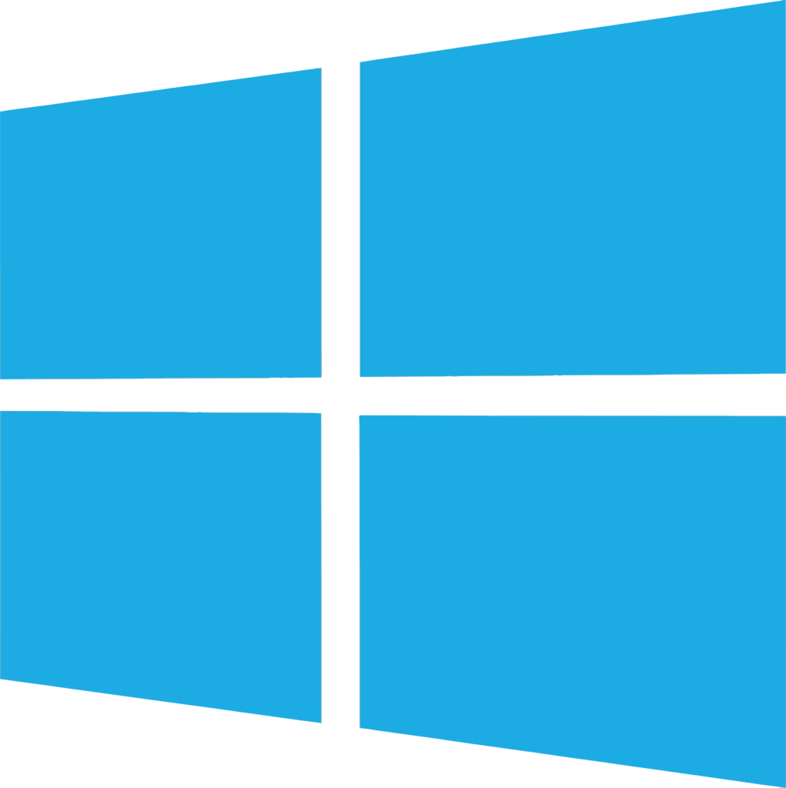
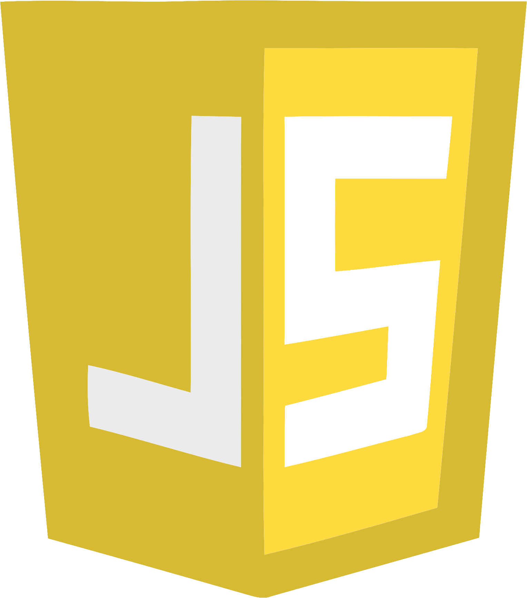
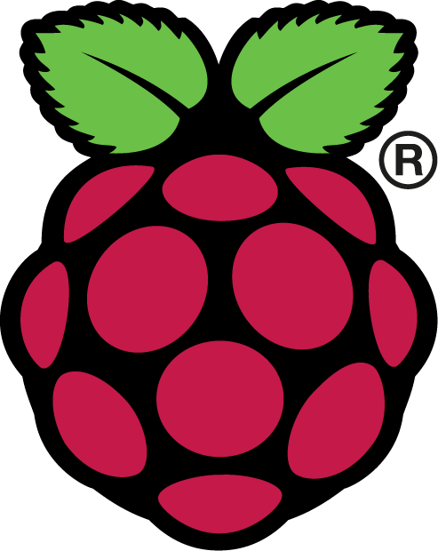
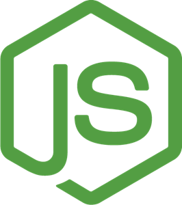
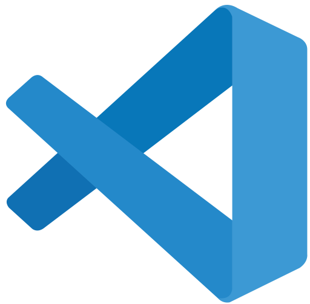

# Alex Stan

Hello there :wave: Welcome to my GitHub page. My name is Alex Stan and I am a passionate and skilled programmer with over 2 years experience in backend development.

## Skills

 

I have been using Javascript/NodeJS for the longest and I am the most comfortable with it. I am also comfortable with Java, Python, and Bash. I've been using Arch and i3 as a daily driver for the longest time, and so I am comfortable with writing CLI applications for Unix/mac systems. Although I am also familiar with the Windows NTFS family of Operating Systems.  

I am very experienced with both Type-1 and Type-2 hypervisors, namely Proxmox and Oracle Virtal-Box. Having numerous iSCSI disks for personal use I am also very familiar with the freeNAS and trueNAS operating systems. I am also very comfortable when it comes to using the shell of the aformantioned Operating Systems. 

## Hobies & Interests

- I love working directly with computer hardware, especially older Enterprise Hardware. 
- I am big fan of the outdoors and love to go either hiking or skiing

# Check out some of my projects :arrow_down::arrow_down:
